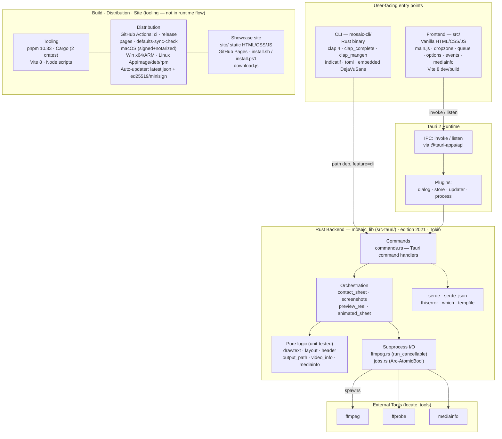

# Tech Stack

Mosaic is a Tauri 2 cross-platform desktop app (plus a sibling CLI) for generating
video contact sheets, screenshots, animated preview reels, and animated contact sheets.

> The **Build · Distribution · Site** cluster is the surrounding tooling/CI — it
> packages and ships the app rather than participating in the request flow, so it's
> shown detached from the runtime graph above.

## Summary by layer

| Layer | Technology |
|-------|-----------|
| **Desktop shell** | Tauri 2 (Rust core + WebView), plugins: dialog, store, updater, process |
| **Frontend** | Vanilla HTML/CSS/JS (no framework), Vite 8 dev/build, `@tauri-apps/api` for IPC |
| **Backend** | Rust 2021, Tokio async, serde, thiserror, which, tempfile — layered as *commands → orchestration → pure logic → subprocess I/O* |
| **CLI** | Sibling Rust crate (`mosaic-cli`) depending on `mosaic_lib` via `feature="cli"`; clap 4, clap_complete, clap_mangen, indicatif, toml |
| **Media engine** | External `ffmpeg` / `ffprobe` / `mediainfo` subprocesses |
| **Tooling** | pnpm 10.33 (JS), Cargo (Rust), Node build scripts |
| **CI/CD** | GitHub Actions (ci, release, pages, defaults-sync-check); signed multi-platform bundles; ed25519/minisign auto-updater |
| **Site** | Static `site/` on GitHub Pages with cross-platform install scripts |

**Defining architectural choice:** strict pipeline separation in the Rust backend — pure,
fully unit-testable logic modules (`drawtext`, `layout`, `header`, `output_path`,
`video_info`) feed orchestration modules that build ffmpeg arg vectors, with all
subprocess I/O isolated in `ffmpeg.rs`. The same library internals are shared between the
GUI and CLI through a feature-flag visibility switch rather than code duplication.
